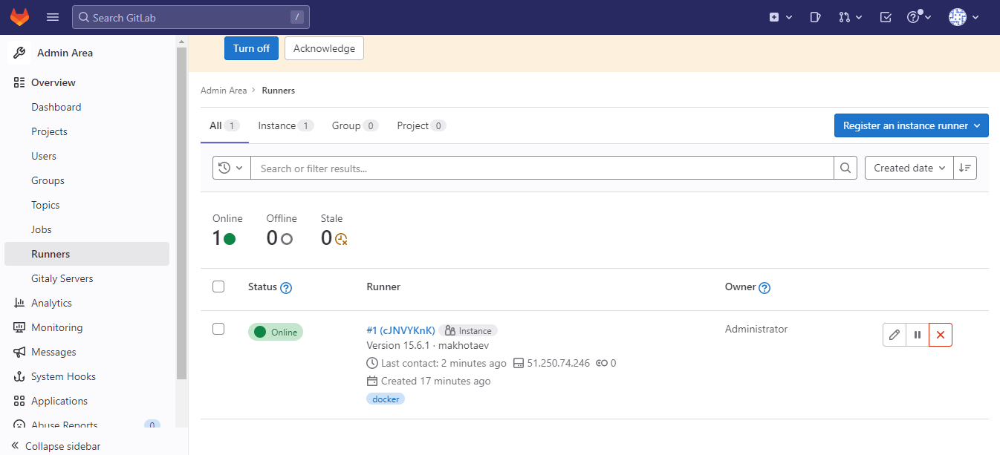

# Домашнее задание к занятию "8.3. Gitlab" - `Елена Махота`


### Инструкция по выполнению домашнего задания

   1. Сделайте `fork` данного репозитория к себе в Github и переименуйте его по названию или номеру занятия, например, https://github.com/имя-вашего-репозитория/git-hw или  https://github.com/имя-вашего-репозитория/7-1-ansible-hw).
   2. Выполните клонирование данного репозитория к себе на ПК с помощью команды `git clone`.
   3. Выполните домашнее задание и заполните у себя локально этот файл README.md:
      - впишите вверху название занятия и вашу фамилию и имя
      - в каждом задании добавьте решение в требуемом виде (текст/код/скриншоты/ссылка)
      - для корректного добавления скриншотов воспользуйтесь [инструкцией "Как вставить скриншот в шаблон с решением](https://github.com/netology-code/sys-pattern-homework/blob/main/screen-instruction.md)
      - при оформлении используйте возможности языка разметки md (коротко об этом можно посмотреть в [инструкции  по MarkDown](https://github.com/netology-code/sys-pattern-homework/blob/main/md-instruction.md))
   4. После завершения работы над домашним заданием сделайте коммит (`git commit -m "comment"`) и отправьте его на Github (`git push origin`);
   5. Для проверки домашнего задания преподавателем в личном кабинете прикрепите и отправьте ссылку на решение в виде md-файла в вашем Github.
   6. Любые вопросы по выполнению заданий спрашивайте в чате учебной группы и/или в разделе “Вопросы по заданию” в личном кабинете.
   
Желаем успехов в выполнении домашнего задания!
   
### Дополнительные материалы, которые могут быть полезны для выполнения задания

1. [Руководство по оформлению Markdown файлов](https://gist.github.com/Jekins/2bf2d0638163f1294637#Code)

---

### Задание 1.

1. Разверните Gitlab локально, используя Vagrantfile и инструкцию, описанные в [этом репозитории](https://github.com/netology-code/sdvps-materials/tree/main/gitlab).   
2. Создайте новый проект и пустой репозиторий в нём.
3. Зарегистрируйте gitlab-runner для этого проекта и запустите его в режиме docker. Раннер можно регистрировать и запускать на той же виртуальной машине, на которой запущен gitlab.

*В качестве ответа добавьте в репозиторий шаблона с решением  скриншоты с настройками раннера в проекте.*

---

### *Ответ к Заданию 1.* 

1. Развернула Gitlab локально, используя Yandex Cloud

 
 
 Вошла под root с паролем
 
 ```bash
sudo cat /etc/gitlab/initial_root_password
```
 
 Создала пользователя, сменила пароль 
 
 
2. Создала новый проект и пустой репозиторий в нём.

 

3. Зарегистрировала gitlab-runner глобально, чтоб мог использоваться и в этом и в других проектах

Скачала несколько images
```bash
 # pull some images in advance
    docker pull gitlab/gitlab-runner:latest
    docker pull sonarsource/sonar-scanner-cli:latest
    docker pull golang:1.17
    docker pull docker:latest
```

Регистрация раннера:
```bash
   docker run -ti --rm --name gitlab-runner \
     --network host \
     -v /srv/gitlab-runner/config:/etc/gitlab-runner \
     -v /var/run/docker.sock:/var/run/docker.sock \
     gitlab/gitlab-runner:latest register
```

Конфигурация раннера для docker-in-docker:
```yaml
    volumes = ["/cache", "/var/run/docker.sock:/var/run/docker.sock"]
```

Запуск:
```bash
   docker run -d --name gitlab-runner --restart always \
     --network host \
     -v /srv/gitlab-runner/config:/etc/gitlab-runner \
     -v /var/run/docker.sock:/var/run/docker.sock \
     gitlab/gitlab-runner:latest
```

 


 
 
 
 

---

### Задание 2.


1. Запушьте [репозиторий](https://github.com/netology-code/sdvps-materials/tree/main/gitlab) на GitLab, изменив origin (это изучалось на занятии по Git)
2. Создайте .gitlab-ci.yml, описав в нем все необходимые на ваш взгляд этапы.

*В качестве ответа  добавьте в шаблон с решением:*    
*- файл gitlab-ci.yml для своего проекта или вставьте код в соответствующее поле в шаблоне,*   
*- скриншоты с успешно собранными сборками.*

---

### *Ответ к Заданию 2.*

1. Запушила [репозиторий](http://51.250.12.82/Makhota/project01/-/tree/main) на GitLab
Изменила origin, добавила оба репозитория для push и для githab и для gitlab


2. Создала .gitlab-ci.yml

```yaml
stages:
  - test
  - build

test:
  stage: test
  tags: 
      - docker
  image: golang:1.17
  script: 
   - go test .

build:
  stage: build
  tags: 
      - docker
  image: docker:latest
  script:
   - docker build .

```


Pipeline успешно отработал


---
## Дополнительные задания (со звездочкой*)

Эти задания дополнительные (не обязательные к выполнению) и никак не повлияют на получение вами зачета по этому домашнему заданию. Вы можете их выполнить, если хотите глубже и/или шире разобраться в материале.

### Задание 3*.

Измените CI таким образом, чтобы:
 - этап сборки запускался сразу, не дожидаясь результатов тестов;
 - тесты запускались только при изменении файлов с расширением *.go.

*В качестве ответа добавьте в шаблон с решением файл gitlab-ci.yml своего проекта или вставьте код в соответсвующее поле в шаблоне.*

---

### *Ответ к Заданию 3.*

1.

